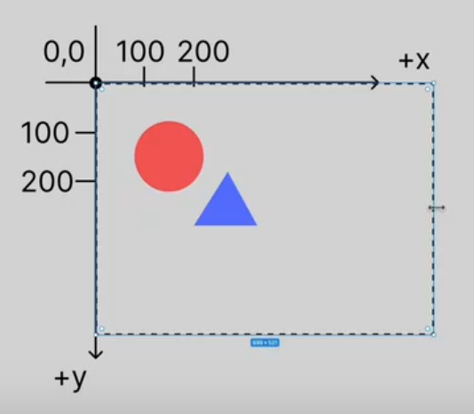
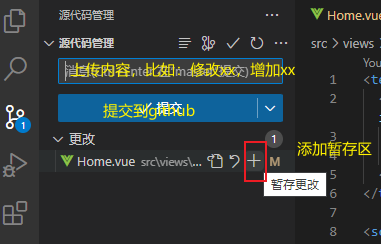
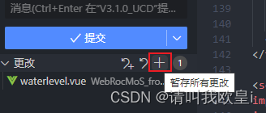
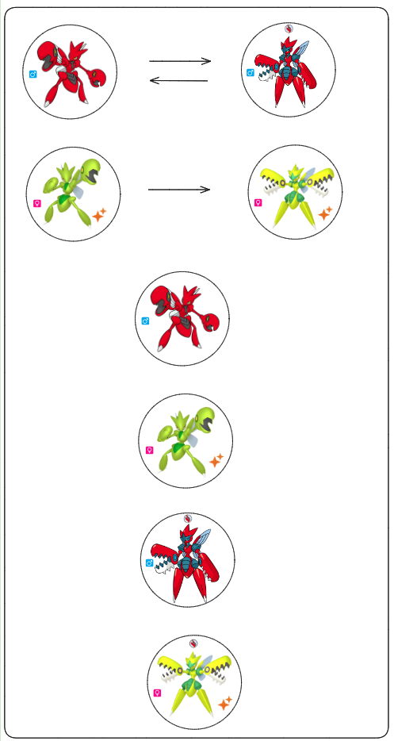

- **svg标签的属性**
    - width，height和viewBox
        在需要svg图形实时响应缩放时，不要设置width，height和viewBox，让svg跟随父元素的宽高大小实现实时缩放响应，示例如下：
        <style>
            #box{
                width: 100px;
                height: 100px;
                border: 1px solid red;
                display: flex;
                justify-content: center;
                align-items: center;
            }
        </style>
        <div id="box">
            <svg t="1730633186931" class="icon" viewBox="0 0 1024 1024" version="1.1" xmlns="http://www.w3.org/2000/svg" p-id="2653"><path d="M412.367 6.389l-63.88 62.071 460.007 446.973-460.007 446.975 63.88 62.071 523.885-509.044z" fill="#272636" p-id="2654"></path></svg>
        </div>
        有时候只设置width，height，不设置viewBox，是为了对svg图形进行切割，比如只显示svg图形的一部分，因为svg图形的元素是基于以下坐标系建立的，不随width，height的改变而改变。
    
- **本地JSON数据文件导入并渲染为表格**
    - fetch函数
      - fetch是JavaScript中的一个全局函数，用于发起网络请求。它可以用于获取资源（如JSON数据、图像等）或发送数据到服务器。
      - 在JavaScript中，当你使用fetch API发送一个网络请求时，这个请求是异步的，意味着它不会立即返回结果，而是允许你的代码继续执行而不会阻塞等待响应。为了处理这种异步行为，fetch函数返回一个Promise对象。
      - Promise对象是JavaScript中用于异步计算的对象。一个Promise有三种状态：pending（进行中）、fulfilled（已成功）和rejected（已失败）。当你调用fetch时，它返回一个Promise，这个Promise初始状态为pending。
      - 解决（resolve）：当异步操作成功完成时，Promise会从pending状态转变为fulfilled状态。这个转变过程被称为“解决”（resolve）。在fetch的上下文中，这意味着网络请求已经成功返回了一个响应。
      - 响应（Response对象）：当fetch的Promise被解决时，它不会直接返回你从服务器获取的数据（如JSON或HTML）。相反，它返回一个Response对象。这个Response对象包含了响应的元数据（如状态码、头部信息等）以及实际响应体的一个只读流。
      - 访问响应数据：为了从Response对象中获取实际的响应数据（比如JSON数据），你需要使用Response对象提供的方法，如json()（用于解析JSON响应）、text()（用于获取文本响应）或blob()（用于获取二进制数据）。这些方法本身也返回Promise对象，因为解析响应体可能是异步的（尤其是对于大型响应）。
      - 语法示例：
        ```javascript
            fetch('https://api.example.com/data')
            .then(response => response.json())
            .then(data => console.log(data))
            .catch(error => console.error('Error:', error));
        ```
        在这个示例中，fetch函数用于发起一个GET请求到"https://api.example.com/data"，then方法用于处理响应，response.json()方法将第一个响应转换为JSON格式，第二个then方法用于处理转换后的数据，这里简单地将数据打印到控制台，catch方法用于处理错误。
        如果需要发送数据到服务器，可以使用fetch函数的第二个参数，它是一个包含请求选项的对象，如使用method选项指定请求的方法（如POST、PUT等），使用body选项指定请求的主体，使用headers选项指定请求的头部。示例如下：
        ```javascript
        fetch('https://api.example.com/data', {
            method: 'POST',
            body: JSON.stringify({ key: 'value' }),
            headers: { 'Content-Type': 'application/json' }
        })
        .then(response => response.json())
        .then(data => console.log(data))
        .catch(error => console.error('Error:', error));
        ```
        在这个示例中，我们使用fetch函数发起一个POST请求到"https://api.example.com/data"，并在请求的主体中发送一个JSON对象。
      - 通过fetch函数可以从服务器上异步获取名为JSON文件内容并返回一个Promise对象，此时JSON文件的内容以对象数组的形式存储数据，需要使用then方法处理Promise对象，调用response.json()方法将其解析为JSON格式，并将其传递到下一个then方法作为下一个回调函数的参数，如下示例
        ```javascript
            fetch('http://localhost:8080/roles.json')
                .then(response => response.json())
                .then(data => {
                    console.log(data);
                }
                )
        ```
        其中response.json()与{console.log(data);}为回调函数，response为HTTP响应（Promise对象），data为response.json()的输出值，也即HTTP响应解析后的值。
      - fetch函数导入的json文件格式不同一般的JSON格式，最外围必须有中括号包裹，如下示例：
        ```json
            [
                {
                    "id": 1,
                    "name": "Admin",
                    "description": "管理员"
                },
                {
                    "id": 2,
                    "name": "User",
                    "description": "普通用户"
                }
            ]
        ```
- document对象
  - document 是 JavaScript 中一个非常重要的内置对象，它代表整个 HTML 或 XML 文档。通过 document 对象，可以访问和操作网页的内容、结构和样式。
  - 实现原理
    当浏览器加载 HTML 文档时，它会创建一个 document 对象，这个对象代表了整个文档。可以使用 document 对象的方法和属性来访问和操作文档的内容。
  - 用途
    - 访问和修改文档内容
      - document.getElementById('id名')
      - document.getElementsByClassName('类名')
      - document.getElementsByTagName('标签名')
      - document.querySelector('选择器')
    - 创建和插入新元素
      - document.createElement('标签名')：在文档中创建一个新的元素节点
      - document.createTextNode("文本内容")：在文档中创建一个文本节点
      - appendChild
      - insertBefore
    - 修改样式：
      - document.styleSheets
    - 处理事件：
      - addEventListener("事件类型", 事件处理函数, 可选的布尔值或对象)：向指定元素添加事件监听器，其中，第三个参数用于指定事件监听器的行为，例如是否在捕获阶段触发（true）或冒泡阶段触发（false，默认值）。
      - removeEventListener
    - 注意事项
      - 跨浏览器兼容性：虽然 document 对象在所有现代浏览器中都可用，但在一些旧版本的浏览器中可能存在兼容性问题。在使用 document 对象的方法和属性时，需要注意浏览器的兼容性。
    - 性能考虑：频繁地访问和修改文档可能会导致性能问题，特别是在大量操作 DOM 时。可以考虑使用文档片段（DocumentFragment）来批量插入元素，或者使用虚拟 DOM 来优化性能。
    - 安全性：在使用 document 对象时，需要注意安全性问题，比如防止 XSS 攻击。
  - 循环结构
    - while循环结构
      - while循环是JavaScript中的一种基本的循环结构，用于在满足特定条件时重复执行一段代码。
      - 基本语法
        ```javascript
            while (condition) {
                // 要重复执行的代码块
            }
        ```
      - 语法示例
        ```javascript
            let sum = 0;
            let i = 1;
            while (i <= 10) {
                sum += i;
                i++;
            }
            console.log("1到10的和是:", sum);
        ```
        - 使用场景
            - 不确定循环次数：当循环次数不确定时，可以使用while循环。例如，用户输入直到输入特定值时停止。
            - 等待某个条件满足：在等待某个条件满足时，可以使用while循环，例如等待用户输入或等待某个事件发生。
    - do...while循环结构
      - do...while循环是JavaScript中的一种基本的循环结构，它首先执行一次循环体，然后再检查条件是否为真。如果条件为真，则继续执行循环体。这个过程会一直重复，直到条件为假时，循环终止。
      - 基本语法
          ```javascript
              let sum = 0;
              let i = 1;
              do {
              sum += i;
              i++;
              } while (i <= 10);
              console.log("1到10的和是:", sum);
          ```
      - 使用场景
        - 至少执行一次：当循环体至少需要执行一次时，可以使用do...while循环。例如，用户输入直到输入特定值时停止，但至少需要让用户输入一次。
        - 等待某个条件满足：在等待某个条件满足时，可以使用do...while循环，例如等待用户输入或等待某个事件发生。
    - for...of循环结构
      - for...of循环是JavaScript中的一种循环结构，用于遍历可迭代对象（如数组、字符串、Map、Set等）中的元素。它提供了一种简洁的方式来遍历集合中的每个元素，而不需要手动管理索引。
      - 基本语法
        ```javascript
            for (const element of iterable) {
                // 对每个元素执行的操作
        }
        ```
        - iterable：一个可迭代对象，如数组、字符串、Map、Set等。
        - element：每次迭代时从可迭代对象中获取的元素。
      - 语法示例
        ```javascript
            const array = [1, 2, 3, 4, 5];
            for (const num of array) {
                console.log(num);     // 输出：1, 2, 3, 4, 5
            }
        ```
    - for...in循环结构
      - for...in循环是JavaScript中的一种循环结构，用于遍历对象的可枚举属性。它提供了一种简洁的方式来遍历对象中的每个属性，而不需要手动管理索引。
      - 基本语法
        ```javascript
            for (const key in object) {
                // 对每个属性执行的操作
            }
        ```
        - object：一个对象，你想要遍历其属性。
        - key：每次迭代时从对象中获取的属性名。
      - 语法示例
        ```javascript
        const obj = { a: 1, b: 2, c: 3 };
        for (const key in obj) {
            console.log(key); // 输出：a, b, c
            console.log(obj[key]); // 输出：1, 2, 3
        }
        ```
        - 注意事项
            - 原型链上的属性：for...in循环会遍历对象自身的以及继承的可枚举属性。如果你只想遍历对象自身的属性，可以使用hasOwnProperty方法进行检查。
              - 原型链（Prototype Chain）是JavaScript中实现继承的一种机制。在JavaScript中，每个对象都有一个内部属性Prototype，指向另一个对象。这个对象称为原型，而原型本身也有自己的原型，以此类推，形成了一条原型链。
              - 当访问一个对象的属性时，如果该对象本身没有这个属性，JavaScript引擎会沿着原型链向上查找，直到找到该属性或者到达原型链的末端（即null）。
              - 通过设置对象的原型，可以实现继承。子对象可以通过原型链访问父对象的属性和方法。
              - 修改原型链会影响所有继承自该原型的对象，因此要谨慎操作。
            - 顺序：for...in循环不保证属性名的顺序。如果你需要按照特定顺序遍历属性，可能需要手动排序。
    - 循环中断：可以使用break、continue和return（在函数中使用）来中断或跳过迭代。
    - 区别：
      - for...in循环用于遍历对象的可枚举属性名，而for...of循环用于遍历可迭代对象中的元素。
      - for...in循环不保证顺序，且会遍历原型链上的属性。
      - while循环结构、do...while循环结构则与一般编程语言的使用一致。
- forEach函数
  - forEach是JavaScript数组的一个方法，用于遍历数组中的每个元素，并对每个元素执行一次提供的函数。
  - 基本语法：
    ```javascript
        array.forEach(function(currentValue, index, arr), thisValue)
    ```
    对数组array的每个元素执行一次提供的函数。函数接收三个参数：
    - currentValue：当前正在处理的元素。
    - index（可选）：当前正在处理的元素的索引。
    - arr（可选）：正在被遍历的数组。
    - 函数的写法
      - 箭头函数
        ```javascript
            let numbers = [1, 2, 3, 4, 5];
            let sum = 0;
            numbers.forEach(number => {
                sum += number;
            });
            console.log("数组元素的和是:", sum);
        ```
        使用箭头函数来定义函数，其中number => {}是一个箭头函数，它接收数组中的每个元素作为参数。箭头函数是ES6（ECMAScript 2015）引入的一种更简洁的函数定义方式。
      - 传统函数
        ```javascript
            let numbers = [1, 2, 3, 4, 5];
            let sum = 0;
            numbers.forEach(function(number) {      // 计算数组中所有元素的和
                sum += number;
            });
            console.log("数组元素的和是:", sum); // 输出：15
        ```
        使用传统的函数表达式来定义函数，其中function(number){}是一个匿名函数，它接收数组中的每个元素作为参数。
      - 差异对比：这两种写法在功能上是等价的，但箭头函数的语法更简洁，特别是当函数体只有一行代码时，可以省略大括号和return关键字。
  - 注意事项
    - forEach方法不会返回新数组，而是对原数组进行操作。
    - forEach方法无法使用break或return语句中断循环。如果需要中断循环，可以使用for循环或for...of循环。
    - 如果数组为空，forEach方法不会执行任何操作。


- flex-grow：
  - flex-grow 是 CSS Flexbox 布局模型中的一个属性，用于定义当父容器有额外空间时，子元素如何分配这些空间。具体来说，flex-grow 属性决定了子元素在主轴方向上（通常是水平方向）的扩展比例。
  - 在 Flexbox 布局中，父容器（称为 flex 容器）会根据其子元素（称为 flex 项目）的 flex-grow 属性值来分配额外的空间。默认情况下，所有子元素的 flex-grow 值都为 0，这意味着它们不会扩展来填充额外的空间。如果将 flex-grow 设置为一个正整数，那么子元素会按照这个值来分配额外的空间。


Object.entries()方法返回一个包含对象自身所有可枚举属性的键值对数组。它不会遍历原型链上的属性。
  ```javascript
      Object.entries(data).forEach(([key, value]) => {
          console.log(`Key: ${key}`);
          console.log(`Value: ${JSON.stringify(value)}`);
      });
  ```
Object.keys()方法返回一个包含对象自身所有可枚举属性名称的数组。它不会遍历原型链上的属性。
  ```javascript
    Object.keys(data).forEach(key => {
        console.log(`Key: ${key}`);
        console.log(`Value: ${JSON.stringify(data[key])}`);
    });
  ```


- 先添加到暂存区，再提交到github，
  
  - 添加到暂存区可以分为单个或全部提交，单个提交点击“更改”下方的某一项右侧的“＋”，全部提交点击“更改”右侧的“＋”。
    
  -  添加到暂存区完毕后，点击“提交”，即可提交到Github。


---

# 天马行空
## 想的太多
### 你才想的太多

# test
## aa

- a
- d

1. d
2. df
3. ff

> dad
>
> dd

```python
print ("hello")

```

x^2_i


|商品|数量|单价|
|-|-------:|:------:|
|苹果|10|\$1|
|电脑|1|\$1000|

 $\sum_{i=1}^n a_i=0$